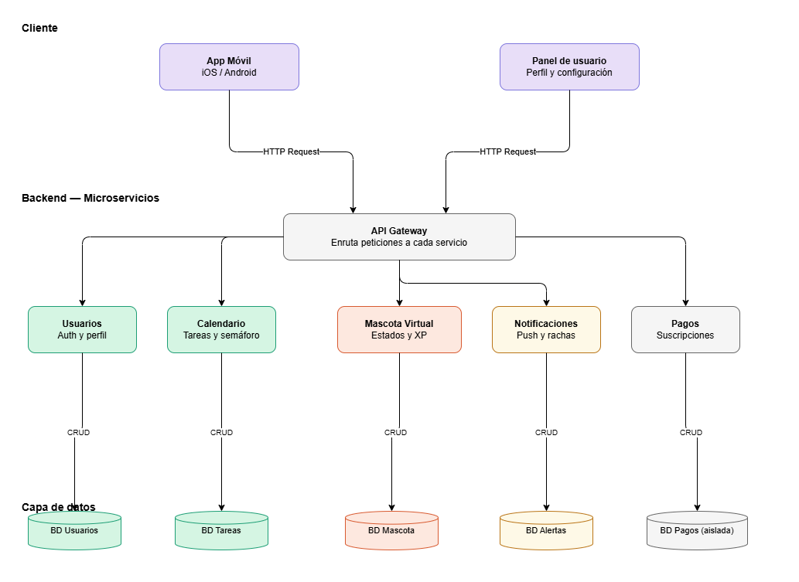

# Diseño arquitectónico: 

Como equipo, llegamos a la decisión de optar por el diseño arquitectónico de __Microservicios__, basándonos en las prioridades de nuestro proyecto y en nuestra visión sobre la función de la página/aplicación, ya que necesitamos muchos procesos que deben funcionar a la vez, pero de manera independiente, como:

* __Microservicio para Usuarios (BD)__: Debido a que necesitamos los datos del usuario, como nombre, email, contraseña, etc.

* __Microservicio de Tareas/Calendario__: Necesitamos conectar con el calendario académico del estudiante o con la agenda del usuario, lo cual se guardaría en la BD para enviar tareas y ajustar la aplicación y la mascota en base a sus ocupaciones.

* __Microservicio para Pagos/Suscripciones__: Esta sección debe ser, sobre todo, la más independiente del resto, para brindar seguridad a través de una BD aislada de las demás y proteger específicamente esta información del usuario.

* __Microservicio para Notificaciones/Rachas__: Servicio en segundo plano para enviar avisos directos al usuario, al igual que actualizar las rachas diarias.

* __Microservicio para Mascota Virtual__: Implementación de IA para mantener al usuario atento a rachas y notificaciones, además de implementar un sistema de recompensa, minijuegos y demás, sin afectar los pagos y conjugándose con los demás servicios.

Esta estructura escogida es compleja de aplicar, pero, a pesar de eso, consideramos que es la más indicada para nuestros objetivos. Al ser todo independiente, podemos organizarnos mejor con cada cambio, así como correlacionar entre sí aquellos microservicios. De esta forma, podemos trabajar de manera independiente en cada uno y, al mismo tiempo, lograr que se integren entre ellos.

### __Diagrama resumen__: 

